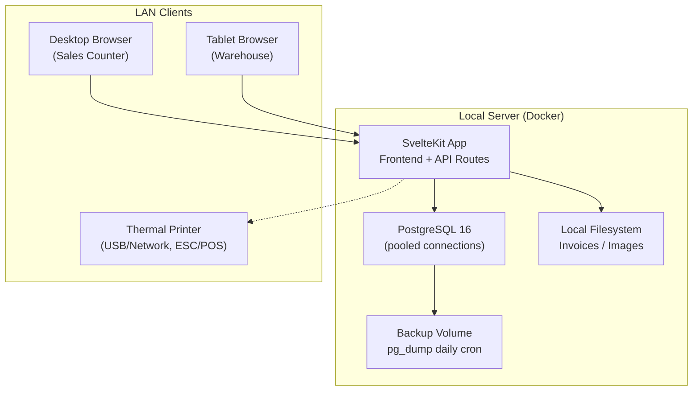
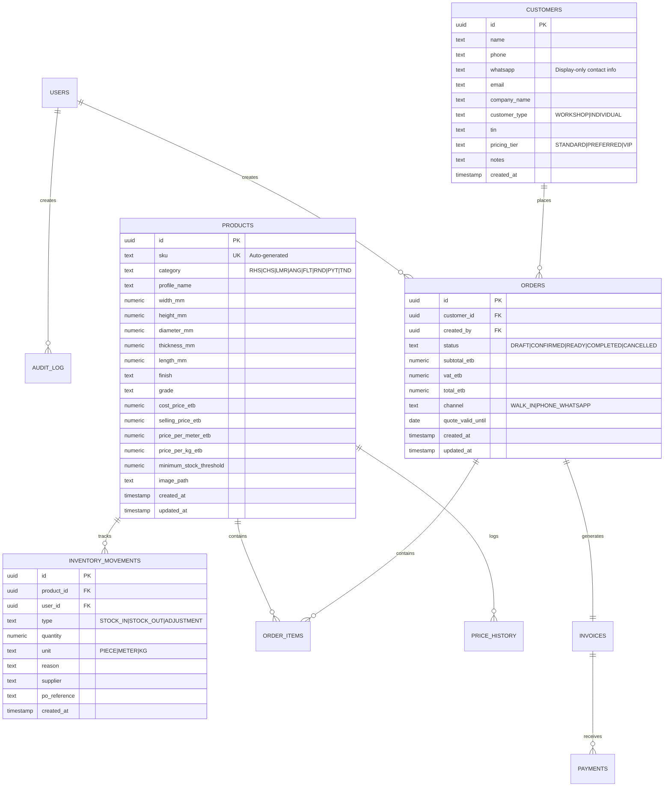

# Nova Metal PLC — CRM & Inventory Management System

On-premise system for a metal building materials vendor in Addis Ababa. Replaces manual tracking with real-time inventory visibility, customer management, and sales automation. Must run entirely on a local LAN with **zero internet dependency**.

---

## User Review Required

> [!IMPORTANT]
> **Technology stack decisions** — the PRD suggests Svelte for frontend and leaves backend open (Node.js or Python). This plan selects **SvelteKit** (full-stack, SSR) + **PostgreSQL** + **Docker**. SvelteKit handles both frontend and API routes, eliminating a separate backend service. If a dedicated REST API is preferred (e.g., FastAPI), flag it now.

> [!IMPORTANT]
> **Phased delivery** — this plan covers **Phase 1 (MVP)** in full detail. Phases 2–4 are outlined structurally so the architecture supports them, but detailed file-level specs will come in follow-up plans per phase.

> [!WARNING]
> **On-premise constraint** — all npm packages, fonts (Noto Sans Ethiopic for Amharic, Inter as local `.woff2` files), icons, and assets must be vendored locally. No CDN calls, no external API calls, no telemetry. Docker images must be pre-built and transferred via USB.

---

## Proposed Architecture



### Stack Rationale

| Layer | Technology | Why |
|-------|-----------|-----|
| **Frontend** | SvelteKit 2 + Svelte 5 (runes) | PRD preference. Compiles to small bundles — critical for LAN speed. |
| **Backend** | SvelteKit API routes (`+server.ts`) | Eliminates separate server. Form actions for mutations. |
| **ORM** | Drizzle ORM (with pooled `pg` driver) | Type-safe, lightweight, excellent PostgreSQL support. Connection pooling configured for 10 concurrent users. |
| **Database** | PostgreSQL 16 | ACID compliance, referential integrity, JSON columns for flexible metadata. |
| **Auth** | better-auth | Actively maintained, native SvelteKit adapter, Drizzle ORM integration, session-based. Replaces Lucia (archived/sunset). |
| **UI Library** | shadcn-svelte (Bits UI primitives) | Accessible, composable, matches Intentional Minimalism. |
| **i18n** | Paraglide.js (inlang) | Compile-time i18n — zero runtime overhead. Amharic + English. |
| **PDF/Quotes** | pdfmake | Client-side PDF generation for quotes (WhatsApp sharing when staff has internet). |
| **Receipts** | @node-escpos/core | ESC/POS protocol for thermal receipt printers via USB or network. Active community fork (original `escpos` unmaintained). |
| **Charts** | Layer Cake (Svelte-native) | Lightweight, SSR-compatible charting. |
| **Backup** | pg_dump cron (daily) | Automated backup to external drive/NAS. Included in Phase 1 — not deferred. |
| **Containerization** | Docker Compose | PostgreSQL + SvelteKit in a single `docker compose up`. |

---

## Skills Integration

The following skills from `~/.gemini/antigravity/skills/` will govern execution:

| Skill | When Applied | Key Mandate |
|-------|-------------|-------------|
| **daneel-protocol** | Always | Receive Partner corrections as teaching. Pivot immediately. Transparent about limits. |
| **frontend-design** | UI implementation | Bold aesthetic direction — no generic AI look. Distinctive typography (not Inter/Roboto). Committed color palette. Intentional motion. |
| **ui-ux-pro-max** | Design system + all UI | Generate design system via `search.py --design-system` before coding any UI. Svelte stack guidelines. Accessibility checklist (4.5:1 contrast, 44px touch targets, aria-labels, keyboard nav). Pre-delivery checklist. |
| **shadcn-ui** | Component implementation | Use **shadcn-svelte** (Svelte port of shadcn/ui) with Bits UI primitives. No custom primitives when the library provides them. |
| **test-driven-development** | All feature code | Strict Red-Green-Refactor. No production code without a failing test first. Vitest for unit tests. |
| **systematic-debugging** | Any bug or failure | 4-phase process: Root Cause → Pattern Analysis → Hypothesis → Implementation. No fixes without investigation. |
| **typescript-advanced-types** | Schema/ORM/API types | Leverage discriminated unions, branded types, and type-level validation for domain safety (SKU types, order status enums). |
| **modern-javascript-patterns** | Utility code | Modern async patterns, proper error handling, functional composition. |
| **component-refactoring** | Ongoing | Extract and compose components as complexity grows. Single responsibility. |
| **form-cro** | Data entry forms | Optimize stock-in, order, and customer forms for speed and error reduction — critical for staff with minimal training. |

> [!NOTE]
> Skills like [seo-audit](file:///Users/richu/.gemini/antigravity/skills/seo-audit), [marketing-psychology](file:///Users/richu/.gemini/antigravity/skills/marketing-psychology), [signup-flow-cro](file:///Users/richu/.gemini/antigravity/skills/signup-flow-cro), [react-native-best-practices](file:///Users/richu/.gemini/antigravity/skills/react-native-best-practices), and [ship-learn-next](file:///Users/richu/.gemini/antigravity/skills/ship-learn-next) are **not applicable** — this is an on-premise internal tool, not a public-facing marketing site or mobile app.

---

## Proposed Changes

### 1. Project Scaffolding & DevOps

#### [NEW] Project root setup

```
nova/
├── docker-compose.yml          # PostgreSQL + SvelteKit + backup cron
├── Dockerfile                  # Multi-stage build for SvelteKit
├── scripts/
│   └── backup.sh               # pg_dump wrapper (daily cron)
├── .env.example                # DB credentials, app config
├── package.json
├── svelte.config.js
├── vite.config.ts
├── drizzle.config.ts
├── tsconfig.json
├── static/
│   └── fonts/                  # Vendored woff2: Inter, Noto Sans Ethiopic
└── src/
    ├── app.html                # Shell HTML
    ├── app.css                 # Global design tokens
    ├── hooks.server.ts         # Auth guard, locale detection
    ├── lib/
    │   ├── server/
    │   │   ├── db/
    │   │   │   ├── index.ts            # Drizzle client (pooled)
    │   │   │   ├── schema/
    │   │   │   │   ├── users.ts
    │   │   │   │   ├── products.ts
    │   │   │   │   ├── inventory.ts
    │   │   │   │   ├── customers.ts
    │   │   │   │   ├── orders.ts
    │   │   │   │   ├── invoices.ts
    │   │   │   │   ├── payments.ts
    │   │   │   │   ├── price-history.ts
    │   │   │   │   └── audit-log.ts
    │   │   │   └── migrations/         # Drizzle generated migrations
    │   │   ├── auth/
    │   │   │   └── index.ts            # better-auth config + RBAC
    │   │   └── printer/
    │   │       └── escpos.ts           # ESC/POS thermal printer driver
    │   ├── components/
    │   │   ├── ui/                     # shadcn-svelte components
    │   │   ├── layout/
    │   │   │   ├── Sidebar.svelte
    │   │   │   ├── Header.svelte
    │   │   │   └── AppShell.svelte
    │   │   ├── inventory/
    │   │   ├── catalog/
    │   │   ├── customers/
    │   │   ├── sales/
    │   │   └── dashboard/
    │   ├── i18n/
    │   │   ├── en.json
    │   │   └── am.json                 # Amharic translations
    │   └── utils/
    │       ├── sku.ts                  # SKU generation logic
    │       ├── currency.ts             # ETB formatting
    │       ├── vat.ts                  # 15% VAT + 3% withholding
    │       ├── pdf.ts                  # Quote/invoice PDF builder
    │       └── receipt.ts              # ESC/POS receipt formatter
    └── routes/
        ├── +layout.svelte              # AppShell, auth check
        ├── +layout.server.ts           # Session loader
        ├── login/
        ├── dashboard/
        ├── inventory/
        │   ├── +page.svelte            # Stock list view
        │   ├── stock-in/
        │   └── stock-out/
        ├── catalog/
        │   ├── +page.svelte            # Product catalog
        │   └── [id]/
        ├── customers/
        │   ├── +page.svelte
        │   └── [id]/
        ├── sales/
        │   ├── quotes/
        │   ├── orders/
        │   └── invoices/
        ├── reports/
        └── settings/
            ├── users/
            └── pricing/
```

---

### 2. Database Schema (Drizzle ORM)

Key tables and their relationships:



---

### 3. Authentication & RBAC

#### [NEW] `src/lib/server/auth/index.ts`

**better-auth** replaces Lucia (archived/sunset late 2024 — unacceptable for a production system with no easy update path).

- Native SvelteKit adapter via `svelteKitHandler` in `hooks.server.ts`
- Drizzle ORM integration for session/user tables
- Session-based auth (no JWT, no external providers needed)
- RBAC via a `role` column on the users table + a permissions map

Permission matrix matching PRD §8:

| Role | Inventory | Sales / CRM | Reports / Settings |
|------|-----------|-------------|-------------------|
| **Admin** | Full CRUD + approvals | Full access | Full access + config |
| **Sales** | View only | Create quotes/orders/invoices, record payments | Own sales reports |
| **Warehouse** | Stock-in/out, adjustments, counts | View orders (fulfillment) | Inventory reports only |

Permissions checked in `hooks.server.ts` on every request via better-auth session + role lookup.

---

### 4. Product Catalog & SKU Engine

#### [NEW] `src/lib/utils/sku.ts`
Auto-generates SKUs per PRD format: `[Category]-[Dimensions]-[Thickness]-[Length]-[Finish]`

Example: `RHS-5050-2.0-6000-BLK`

- Validates uniqueness against DB
- Manual override for custom/non-standard items (flagged in audit log)

---

### 5. Inventory Module (Phase 1 core)

#### [NEW] `src/routes/inventory/` pages
- **Stock list**: Filterable by category, dimensions, thickness. Visual indicators for low/out-of-stock.
- **Stock-in form**: Supplier info, PO reference, date, quantities (by piece or weight), cost price capture. Atomic DB transaction on confirm.
- **Stock-out**: Automatic deduction on sale completion. Manual adjustment with reason + user attribution.
- **Movement history**: Full audit trail with filters.

> [!NOTE]
> All inventory mutations are wrapped in PostgreSQL transactions. No partial updates. Rollback on failure. This satisfies PRD §7 Data Integrity.

---

### 6. Design System & UI

#### [NEW] `static/fonts/`
Vendored `.woff2` files — **Inter** (English) and **Noto Sans Ethiopic** (Amharic). Downloaded from Google Fonts, self-hosted. Loaded via `@font-face` in `app.css`. No CDN calls.

#### [NEW] `src/app.css`
Design tokens: dark mode default, steel/industrial color palette. `@font-face` declarations pointing to `/fonts/*.woff2`.

#### [NEW] `src/lib/components/layout/AppShell.svelte`
Responsive sidebar layout. Collapses to bottom nav on mobile/tablet for warehouse staff.

Using **shadcn-svelte** components (Button, Input, Dialog, Table, Select, etc.) — no custom primitives.

---

### 7. Thermal Receipt Printing

#### [NEW] `src/lib/server/printer/escpos.ts`
Thermal receipt printers use **ESC/POS protocol**, not PDF. `pdfmake` is used only for quotes/invoices (standard A4 PDFs for WhatsApp sharing).

- Uses `@node-escpos/core` (active community fork — the original `escpos` package is unmaintained)
- Connects via USB (serial) or network (TCP) depending on printer model
- Receipt layout: company header, items table, totals, VAT breakdown, footer
- Server-side API route (`/api/print`) receives order ID, builds ESC/POS commands, sends to printer

#### [NEW] `src/lib/utils/receipt.ts`
Formats receipt data (items, totals, VAT) into ESC/POS command sequences.

> [!NOTE]
> Partner: we need the specific thermal printer model to confirm USB vs. network connection and paper width (58mm vs. 80mm).

---

### 8. Internationalization

#### [NEW] `src/lib/i18n/en.json` & `am.json`
Compile-time i18n via Paraglide.js. Language toggle in header. Persisted in user session.

---

### 9. Ethiopian Business Logic

#### [NEW] `src/lib/utils/vat.ts`
- 15% VAT calculation (configurable)
- 3% withholding tax on vendor purchases
- ETB currency formatting (Amharic numeral support optional)

---

### 10. Database Backup (Phase 1 — not deferred)

#### [NEW] `scripts/backup.sh`
Automated daily `pg_dump` to an external drive or NAS mount. Run via cron inside the Docker Compose stack.

- Compressed `.sql.gz` with timestamp filename
- 30-day retention (auto-delete older backups)
- Backup volume mapped in `docker-compose.yml` to `/mnt/backup` (external drive)
- Failure logging: write to **both** `audit_log` table and a local file (`/var/log/nova-backup.log`) on the host filesystem — if PostgreSQL is down, the DB write fails silently but the file log always persists

> [!CAUTION]
> For a metal vendor running entirely on-premise with no cloud fallback, losing the database is catastrophic. Even one week of sales data loss is a serious business problem. Backup **must** ship in Phase 1.

---

### 11. Connection Pooling

#### [MODIFY] `src/lib/server/db/index.ts`
Drizzle ORM's `pg` driver configured with connection pool settings:

- `max: 15` (handles 10 concurrent LAN users + headroom)
- `idleTimeoutMillis: 30000`
- `connectionTimeoutMillis: 5000`

This prevents connection exhaustion when sales counter, warehouse tablets, and admin hit PostgreSQL simultaneously.

---

## Phases 2–4 (Structural Outline)

These will be planned in detail after Phase 1 delivery. The Phase 1 schema and architecture are designed to support them without breaking changes.

| Phase | Key Features | Schema Ready? |
|-------|-------------|:---:|
| **Phase 2** (Sales & CRM) | Quotation workflow, order status tracking, customer profiles, purchase history, payment recording, receipt printing | ✅ Tables included in Phase 1 schema |
| **Phase 3** (Intelligence) | Pricing engine (tiers, bulk discounts), reporting dashboard (KPIs, charts), daily cash reconciliation | ✅ `price_history`, `payments` tables ready |
| **Phase 4** (Operations) | Physical count workflow, barcode scanning prep, cloud sync prep | ✅ `audit_log` ready. Backup already in Phase 1. |

---

## Verification Plan

### Development Methodology (per [test-driven-development](file:///Users/richu/.gemini/antigravity/skills/test-driven-development) skill)

All feature code follows strict **Red-Green-Refactor**:
1. Write a failing test that describes the desired behavior
2. Verify it fails for the right reason
3. Write minimal code to pass
4. Refactor while keeping tests green

Bug fixes follow the [systematic-debugging](file:///Users/richu/.gemini/antigravity/skills/systematic-debugging) skill: Root Cause Investigation → Pattern Analysis → Hypothesis → Implementation. No fixes without a failing test.

### Automated Tests

1. **Unit tests** — Vitest (ships with SvelteKit)
   - SKU generation logic (`sku.test.ts`)
   - VAT/withholding tax calculation (`vat.test.ts`)
   - RBAC permission checks (`rbac.test.ts`)
   - Run: `npm run test:unit`

2. **Database migration test**
   - Drizzle migration applies cleanly to a fresh PostgreSQL instance
   - Generate: `npx drizzle-kit generate` (creates migration SQL files)
   - Apply: `npx drizzle-kit migrate` (runs migration files against DB)
   - **Never use `drizzle-kit push` in production** — it bypasses migration files entirely

3. **Snyk security scan** (via Snyk MCP) — scan dependencies + code before deployment
   - SCA: `snyk_sca_scan` on project path
   - SAST: `snyk_code_scan` on project path
   - IaC: `snyk_iac_scan` on Dockerfile + docker-compose.yml

### UI Quality (per [ui-ux-pro-max](file:///Users/richu/.gemini/antigravity/skills/ui-ux-pro-max) pre-delivery checklist)

4. No emoji icons — SVG only (Lucide)
5. All clickable elements have `cursor-pointer`
6. Light/dark mode contrast ≥ 4.5:1
7. Responsive at 375px, 768px, 1024px, 1440px
8. `prefers-reduced-motion` respected
9. Form inputs have labels, aria-labels on icon buttons

### Browser Tests (Post-Implementation)

10. **Login flow** — verify RBAC redirects per role
11. **Stock-in flow** — add stock, verify DB count increases atomically
12. **Product catalog** — create product, verify auto-SKU
13. **Responsive layout** — verify tablet/mobile breakpoints

### Manual Verification (Partner-Assisted)

14. **Amharic rendering** — Partner confirms Noto Sans Ethiopic renders correctly on target hardware
15. **Thermal printer** — receipt prints correctly on the specific printer model at the store
16. **On-premise deployment** — `docker compose up` on target server hardware with no internet access

> [!TIP]
> For items 14–16 we need the Partner's input on target hardware specs, printer model, and whether a test server is available for dry-run deployment.
